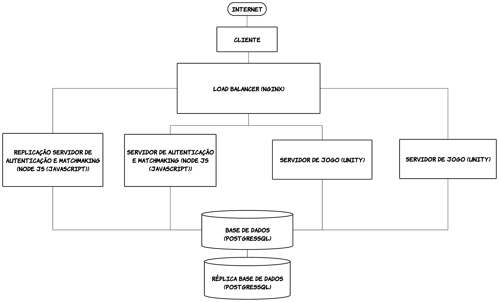

# **Slidebal**

Engenharia Informática

ANO/SEMESTRE: 2023-2024 / 5º Semestre

PROJETO MULTIDISCIPLINAR:

- Engenharia de Software ( Professor: Alessandro Pinheiro)
- Segurança Informática ( Professor: Sérgio Nunes )
- Sistemas Distribuídos ( Professor: Pedro Rosa )

Carolyne Silva - 20210046  

Gustavo Farinha – 20211115

# Slideball

**Slideball** é um jogo multiplayer de futebol que promete essencialmente partidas de curta duração, mas caso o utilizador pretenda uma partida mais longa este vai ser um parâmetro customizável. O foco principal é alcançar a marca de 3 pontos, ou seja, golos. Este desafio acrescenta uma camada adicional de complexidade ao jogo, pois os jogadores precisam de controlar a movimentação do personagem sabendo que este escorrega ao andar no campo, o que torna a tarefa de pontuar mais desafiadora.

Oferecemos dois modos de jogo distintos para proporcionar variedade e entretenimento aos jogadores. Os protagonistas do modo de jogo principal são apenas dois: o jogador e o adversário que jogam a partida um contra o outro. O segundo modo é o modo torneio, onde jogam 8 jogadores que competem e quem perder é eliminado e assim sucessivamente.
Durante as partidas, os servidores coordenam a jogabilidade, permitindo que os jogadores controlem os seus personagens e interajam em um ambiente virtual. Isso inclui a movimentação dos jogadores e a interação com a bola, que ocorre de forma precisa e responsiva devido ao processamento dos servidores.

No final da partida, os resultados são registados e comunicados aos jogadores, incluindo estatísticas de desempenho. Os servidores também permitem que os jogadores decidam se desejam iniciar uma nova partida ou encerrar a sessão.

Dentro do contexto do modo de partida, o jogo operará em um ambiente online que se baseia em servidores dedicados para garantir a estabilidade e o desempenho necessários ao suportar partidas multiplayer. Quando um jogador inicia uma partida, ele é automaticamente conectado aos servidores do jogo, que gerenciam a alocação de jogadores e a comunicação em tempo real.
Nesse ambiente online, a infraestrutura técnica dos servidores é fundamental para garantir uma experiência de jogo estável e envolvente, com todos os aspectos técnicos do jogo sendo cuidadosamente tratados para proporcionar uma experiência suave e justa aos participantes.

O Nosso público-alvo é composto por indivíduos apaixonados por jogos, com especial destaque para os amantes de desporto, especialmente o futebol. Além disso, estamos de braços abertos para receber jogadores que apreciam experiências de jogo mais dinâmicas e rápidas. O **Slideball** foi projetado para proporcionar diversão, desafio e emoção a todos os tipos de jogadores, independentemente do seu nível de habilidade. 

Alguns jogos semelhantes que envolvem desporto ou jogabilidade baseada em habilidades incluem:

**KeyBall**: Foi nossa inspiração para o projeto, é um jogo que já não se encontra disponível em sites regulares mas que foi conhecido e é extremamente difícil de encontrar jogos comparáveis.
**Rocket League**: Combina futebol com carros onde existem imensos tipos de jogos incluindo 2v2, 3v3, torneios entre outros modos de diversão e o objetivo é conseguir controlar a bola com o carro e marcar golos ao mesmo tempo que também precisa de defender a própria baliza.
**Insane Soccer**: Trata-se de um mini jogo online para dois jogadores.

# Arquitetura de Aplicação

Plataformas:

-Load Balancer/Reverse Proxy: NGINX  
-Desenvolvimento de Servidor e linguagem: Node js(Javascript)  
-Editor de Código: Visual Studio Code  
-Software do jogo: Godot Engine  
-Base de Dados: PostgresSQL

# Guiões de Teste 

## Página Inicial do Jogador:

- Na página inicial, o jogador encontrará as opções "Jogar" e "Login".
- Ao clicar em "Jogar", ele será redirecionado para a tela do "Modo de Jogo".
- Caso clique em "Login", o utilizador terá a opção de fazer login em uma conta existente ou registar uma nova conta.

## Login:

- Para acessar a página inicial do jogo, siga os passos abaixo:
- Na página inicial, logo abaixo de "Jogar", você encontrará um botão para fazer login.
- O jogador deve possuir uma conta registada, que requer um email válido e uma senha.
- Após inserir os dados corretos, clique no botão "Entrar" para acessar a conta ou no botão "Registar" para criar uma nova conta.

## Registo:

- No caso de registo:
- Na página de login, o jogador clica no botão "Registar".
- Será solicitado que o jogador forneça seu email, Nickname, data de nascimento e uma senha segura.
- Após preencher os campos obrigatórios, o jogador clica em "Registar" para criar uma nova conta.

## Modos de Jogo:
- Nesta etapa, o jogador pode escolher entre os modos "Partida" e "Torneio".
- Se o jogador escolher o modo "Partida", ele será direcionado diretamente para iniciar uma partida do jogo.
- Se optar pelo modo "Torneio", ele será adicionado a uma fila de espera para a criação de equipes em um torneio.

# Casos de Utilização

## Caso Principal: 

Para começar a jogar **Slideball**, o jogador escolhe seu modo de jogo preferido. O objetivo é participar num jogo de futebol contra um adversário controlado por outro jogador. O jogador pode facilmente controlar o seu personagem utilizando o teclado, e para chutar a bola basta tocar nela. O jogo tem como meta principal marcar 3 golos em um período definido pelos utilizadores. Caso, no final do tempo de jogo os jogadores ficarem empatados e não atingirem os 3 pontos terão um tempo de um minuto, aquele que marcar o primeiro gol vence o jogo, caso não aconteça o será atribuído o empate. No final da partida, o jogador recebe uma pontuação com base em seu desempenho e pode optar por iniciar uma nova partida. 

## Casos Secundários:

No modo torneio, após vencer a partida inicial, o jogador avança para a próxima fase, onde enfrentará outros adversários em uma série de emocionantes confrontos. O objetivo principal é progredir vencendo cada partida e, finalmente, buscar a vitória no torneio. O jogador continuará enfrentando diferentes oponentes, até que apenas um jogador seja coroado como o campeão do torneio.
No login ou registar, o utilizador basta na página inicial clicar no botão correspondente e preencher conforme os seus dados, caso não tenha conta faz o registo, caso já tenha apenas preenche com os seus dados para obter acesso à conta com os seus registos e dados.

## 

## Referência:
KeyBall:
(https://flasharch.com/en/archive/play/5740ec5c51af1dd2965903b0390534a0)
Insane soccer:
(https://www.miniplay.com/game/insane-soccer)
Criação do vídeo e art do jogo:
(https://www.canva.com/)
Arquitetura
(https://lucid.app/)
