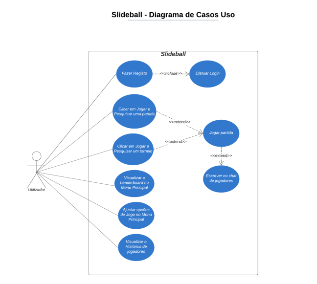
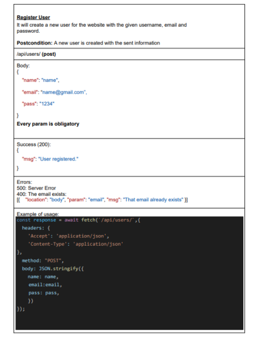
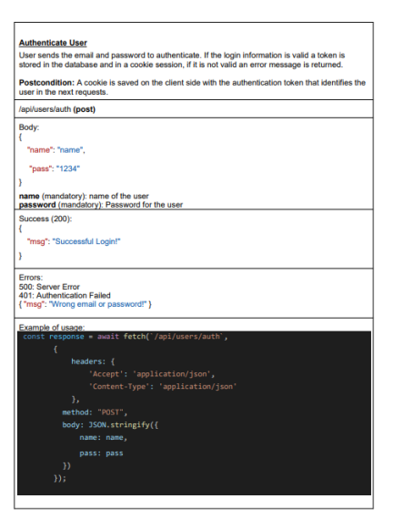
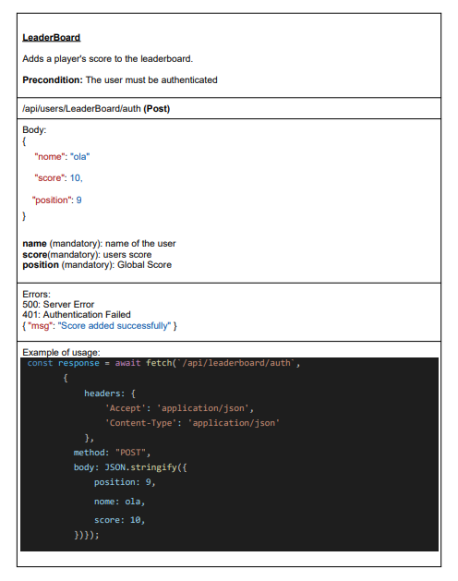
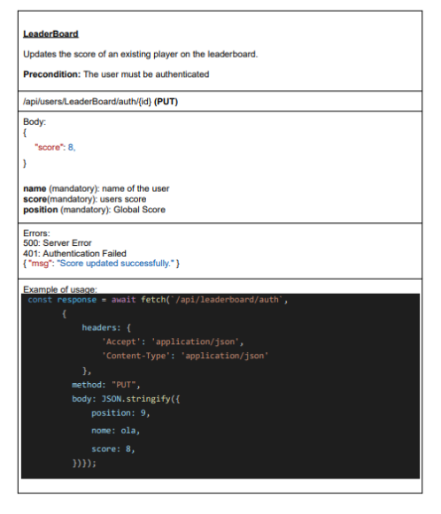

# **Slidebal**

Engenharia Informática

ANO/SEMESTRE: 2023-2024 / 5º Semestre

PROJETO MULTIDISCIPLINAR:

- Engenharia de Software ( Professor: Alessandro Pinheiro)
- Segurança Informática ( Professor: Sérgio Nunes )
- Sistemas Distribuídos ( Professor: Pedro Rosa )
- Projeto de Desenvolvimento de Software ( Professor: André Sabino)

Carolyne Silva - 20210046  

Gustavo Farinha – 20211115

# Slideball
Slideball é um jogo online multiplayer de futebol que promete essencialmente partidas de curta duração. O foco principal é alcançar a marca de 3 pontos, ou seja, golos. Este desafio acrescenta uma camada adicional de complexidade ao jogo, pois os jogadores precisam de controlar a movimentação do personagem sabendo que este escorrega ao andar no campo, o que torna a tarefa de pontuar mais desafiadora.
Oferecemos dois modos de jogo distintos para proporcionar variedade e entretenimento aos jogadores. Os protagonistas do modo de jogo principal são apenas dois: o jogador e o adversário que jogam a partida um contra o outro. O segundo modo é o modo torneio, onde jogam 8 jogadores que competem em 4 partidas e quem perder é eliminado e assim sucessivamente.

# Guiões de Teste 

## Página Inicial do Jogador:

- Na página inicial, o jogador encontrará as opções "Start" ,"Options" e “Exit”.
- Ao clicar em "Start", ele será redirecionado para a tela do "Modo de Jogo".
- Caso clique em "Options", o utilizador terá a opção de fazer login em uma conta existente ou registar uma nova conta.
- Caso clique em "Exit", o jogo será encerrado.

## Login:

- Na página inicial, você encontrará um botão de “Options”, ao clickar, será direcionado a uma tela onde terá a opção de se Logar.
- O jogador deve possuir uma conta registada, que requer um email válido e uma senha.
- Após inserir os dados corretos, clique no botão "Login" para acessar a conta ou no botão "Register" para criar uma nova conta.

## Registo:

- No caso de registo:
- Na página de login, o jogador clica no botão "Register".
- Será solicitado que o jogador forneça seu email, Nickname, data de nascimento e uma senha segura.
- Após preencher os campos obrigatórios, o jogador clica em "Done" para criar uma nova conta.

## Modos de Jogo:
- Após selecionar "Start" no menu principal, o jogador será direcionado a um Lobby
- Nesta etapa, o jogador pode escolher entre os modos "Partida" e "Torneio".
- Se o jogador escolher o modo "Partida", ele será direcionado diretamente para iniciar uma partida do jogo.
- Se optar pelo modo "Torneio", ele será adicionado a uma fila de espera para a criação de equipes em um torneio.

# Diagrama De Casos de Uso

  

# Diagrama De Dominios

# SlideBall Rest API

## Register User

  

## Authenticate User

  

## Logout User

 

## LeadBoard Get

  

## LeadBoard Post

## LeadBoard Put

## VerifyAuth

