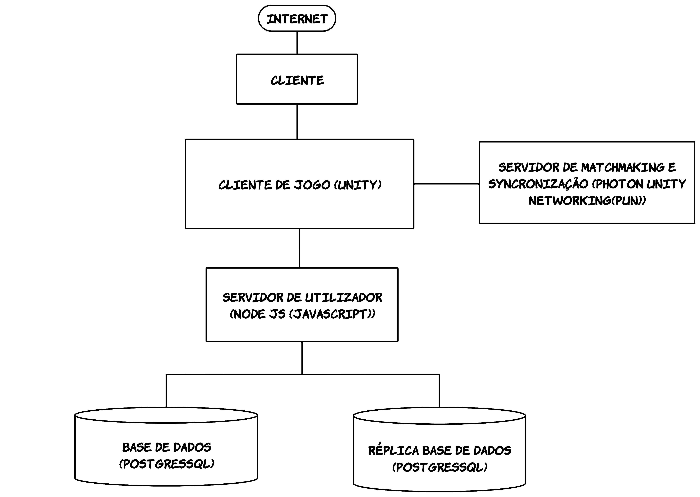
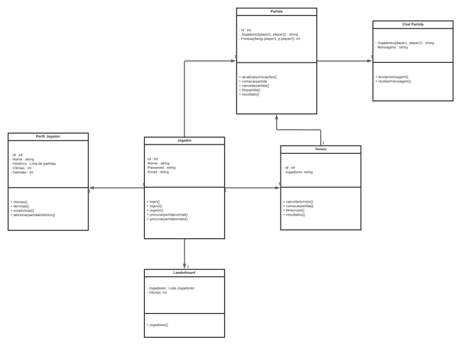
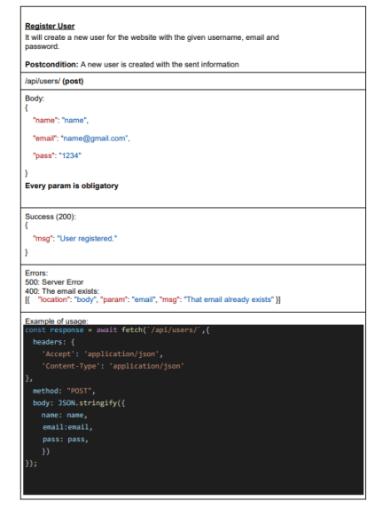
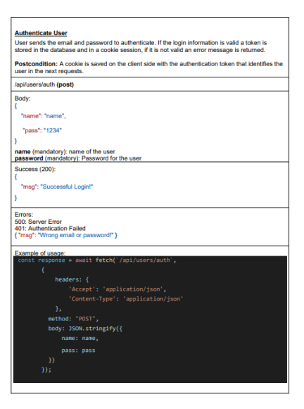
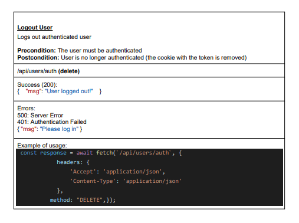
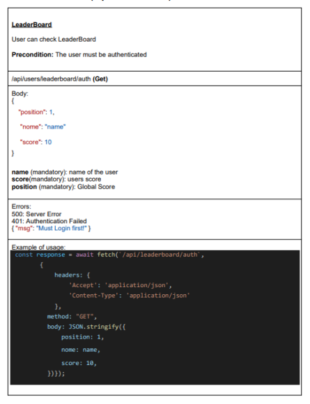
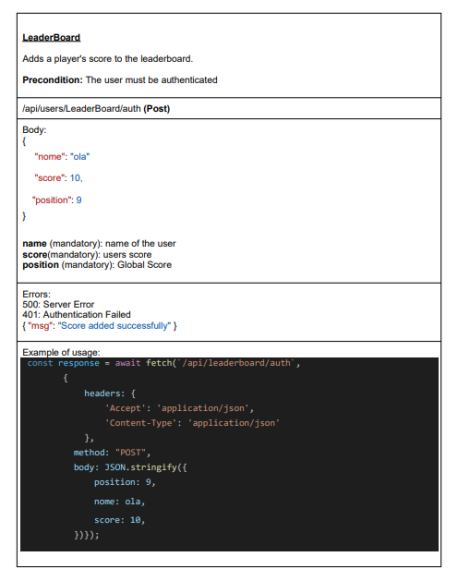
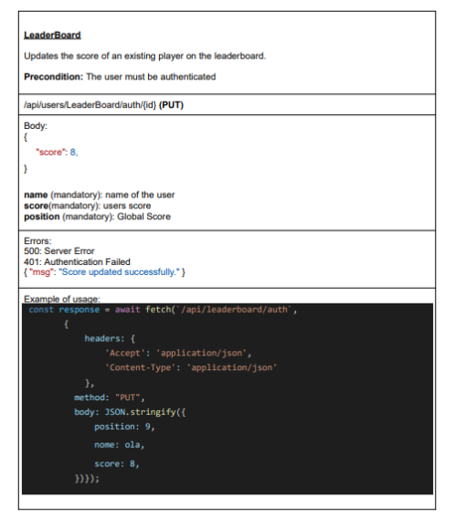

# **Slidebal**

Engenharia Informática

ANO/SEMESTRE: 2023-2024 / 5º Semestre

PROJETO MULTIDISCIPLINAR:

- Engenharia de Software ( Professor: Alessandro Pinheiro)  
- Segurança Informática ( Professor: Sérgio Nunes )  
- Sistemas Distribuídos ( Professor: Pedro Rosa )  
- Projeto de Desenvolvimento de Software ( Professor: André Sabino)

Carolyne Silva - 20210046  

Gustavo Farinha – 20211115

# Slideball
Slideball é um jogo online multiplayer de futebol em que o foco principal é alcançar a marca o máximo de pontos/golos que conseguir em 3 minutos. Este desafio acrescenta uma camada adicional de complexidade ao jogo, pois os jogadores precisam de controlar a movimentação do personagem sabendo que este escorrega ao andar no campo, o que torna a tarefa de pontuar mais desafiadora.Os protagonistas do modo de jogo principal são apenas dois: o jogador e o adversário que jogam a partida um contra o outro. 
O Nosso público-alvo é composto por indivíduos apaixonados por jogos, com especial destaque para os amantes de desporto, especialmente o futebol. Além disso, estamos de braços abertos para receber jogadores que apreciam experiências de jogo mais dinâmicas e rápidas. O Slideball foi projetado para proporcionar diversão, desafio e emoção a todos os tipos de jogadores, independentemente do seu nível de habilidade.

Alguns jogos semelhantes que envolvem desporto ou jogabilidade baseada em habilidades incluem:

KeyBall: Foi nossa inspiração para o projeto, é um jogo que já não se encontra disponível em sites regulares mas que foi conhecido e é extremamente difícil de encontrar jogos comparáveis.

Rocket League: Combina futebol com carros onde existem imensos tipos de jogos incluindo 2v2, 3v3, torneios entre outros modos de diversão e o objetivo é conseguir controlar a bola com o carro e marcar golos ao mesmo tempo que também precisa de defender a própria baliza.

Insane Soccer: Trata-se de um mini jogo online para dois jogadores.

# Guiões de Teste

## Login/Registo:

- Ao iniciar o jogo, você encontrará as opções de se Logar ou registar.
- O jogador deve possuir uma conta.
- Após inserir os dados corretos, clique no botão "Login" para acessar a conta ou no botão "Registar" para criar uma nova conta.
- Caso seja necessário registar um novo jogador, será solicitado que forneça seu email, username e uma senha segura.
- Após preencher os campos obrigatórios, o jogador clica em "registar" para criar uma nova conta.

## Página Inicial do Jogador:
- Na página inicial, o jogador encontrará as opções "Start" ,”Leaderboard”,  "Options" e “Exit” que será um ícone em formato de “X”.
- Ao clicar em "Start", ele será redirecionado para a tela que irá conectar o jogador ao servidor dedicado.
- Caso clique em "Options", o utilizador terá a opção de aumentar e diminuir o volume. 

## Lobby:
- Após se conectar ao servidor dedicado, o jogador terá a opção de criar “Rooms”
- Para iniciar o jogo, o utilizador terá uma opção para criar uma “Room” e aguardar um segundo jogador.
- Assim que o segundo jogador se conectar a “Room”, será mostrado um botão de “Start”, apenas para o criador da “Room” em questão.
- Assim que o dono da “Room” clicar no botão de Start o jogo será iniciado.

## Leaderboard:
- À medida que os jogadores fazem partidas, a quantidade de golos marcados é guardada na leaderboard, em que 1 golo equivale a 1 ponto.
- Existe uma ordem descendente de pontos onde quem tem mais fica em primeiro da lista.

## Jogo:
- Dentro do jogo, o jogador deve marcar o máximo de golos que conseguir no tempo estimado.
- Os jogadores podem falar com o seu adversário por um chat de texto.

# Manual de Utilizador
Para iniciar uma partida no Slideball, o jogador deve primeiro fazer login em sua conta. Seguidamente o jogo é direcionado para um menu principal onde pode ver a leaderboard ou definir as suas opções. A seguir é possível escolher o modo de jogo e seguir para a criação de salas. Estas são criadas pelos jogadores para que outros possam entrar e encontrar partida. Quando os jogadores necessários estiverem presentes na sala, o dono da sala pode começar o jogo, apenas o host terá visibilidade ao botão de “Start”. Para entrar na sala basta clicar numa das salas criadas que estão numa lista. 
O objetivo é enfrentar outro jogador em um jogo de futebol, onde cada um controla seu próprio personagem. O controle do personagem é fácil, realizado através do teclado(WASD ou teclas), enquanto o chutar na bola é ativado com um simples toque nela. O desafio é marcar o máximo de golos possíveis num período de 3 minutos. Dentro de jogo o utilizador pode falar com o adversário escrevendo num chat de texto.	
Ao final da partida, o jogador recebe uma pontuação baseada no número de golos marcados. Após os 3 minutos de jogo, o utilizador é automaticamente redirecionado para a tela de criação de uma nova partida, permitindo a fácil e rápida iniciativa de um novo jogo. Este processo facilita a continuidade e a imersão do jogador no Slideball, promovendo uma experiência contínua e dinâmica.

# Tecnologias Utilizadas:

- Desenvolvimento de Servidor de Utilizador(Autenticação e informações relativas aos jogadores) : Node js(Javascript);
- Editor de Código: Visual Studio Code;
- Software do jogo: Unity Engine;
- Linguagem em Unity: C#;
- Servidor de Matchmaking e Sincronização: Photon Pun 2(Cloud Server);
- Replicação de Base de Dados : Docker;
- Base de Dados: PostgreSQL.

# Segurança

Em termos de segurança foi implementado neste projeto o hashing e salting de  passwords guardadas na base de dados permitindo uma maior segurança. Na autenticação são usados tokens para controlar as sessões e permitindo longas sessões.  Para uma maior segurança dos dados foi ainda replicada a base de dados.
Medidas que poderiam ser implementadas no nosso projeto seriam a autenticação por vários fatores aumentando sua robustez; Uma implementação de um sistema para a identificar cheats, garantindo a integridade do jogo; A Criação de  um sistema de matchmaking mais seguro validando a identificação dos jogadores. Para isso descreveremos abaixo o que gostaríamos de ter feito.

- Autenticação de Vários Fatores (MFA): Implementar a autenticação de vários fatores, como o uso de códigos de verificação enviados por SMS, autenticação biométrica ou tokens gerados por aplicativos autenticadores. Isso adiciona uma camada extra de segurança, exigindo mais do que apenas uma senha para acessar as contas dos usuários.

- Detecção de Cheats: Desenvolver um sistema robusto para identificar possíveis trapaças no jogo. Isso pode incluir a monitorização de padrões de comportamento suspeitos, o uso de software de terceiros não autorizado, ou a detecção de modificações não permitidas no cliente do jogo.

- Integridade do Jogo: Implementar medidas que garantam a integridade do jogo, como a validação constante dos arquivos do cliente para evitar modificações não autorizadas. Também é importante monitorar e responder rapidamente a qualquer atividade suspeita que possa comprometer a experiência de jogo dos usuários.

- Sistema de Matchmaking Mais Seguro: Aprimorar o sistema de matchmaking para validar de forma mais rigorosa a identificação dos jogadores. Isso pode envolver a verificação de autenticidade dos perfis, histórico de jogos e a detecção de comportamento prejudicial.

- Monitoramento Proativo: Implementar um sistema de monitoramento proativo que alerta automaticamente sobre atividades suspeitas ou violações de segurança. Isso permite uma resposta rápida a potenciais ameaças antes que causem danos significativos.

- Educação dos Usuários: Promover a conscientização e educação dos usuários sobre práticas seguras. Incentivar o uso de senhas fortes, a ativação de MFA e fornecer informações sobre como evitar ameaças de segurança ajudará a criar uma comunidade mais segura.

- Atualizações e Patching: Manter o software do jogo, servidores e todas as ferramentas relacionadas atualizadas. Corrigir quaisquer vulnerabilidades conhecidas e aplicar patches regularmente para garantir que o ambiente de jogo esteja protegido contra as últimas ameaças de segurança.

# Diagrama de Arquitetura

# Diagrama de Casos de Uso

# Diagrama de Domínios

# SlideBall Rest API

- Users ( /api/users)
→Register User
→Authenticate User
→Logout User

- Users Leaderboard
→Leaderboard
→Add Player Score
→Update Scores

-

-

-

-

-

-